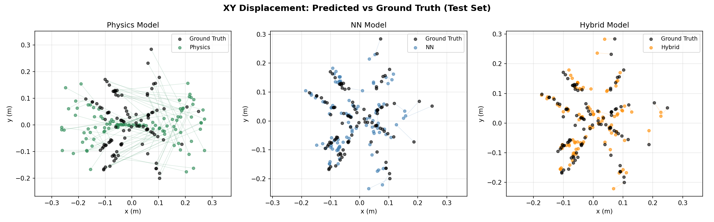
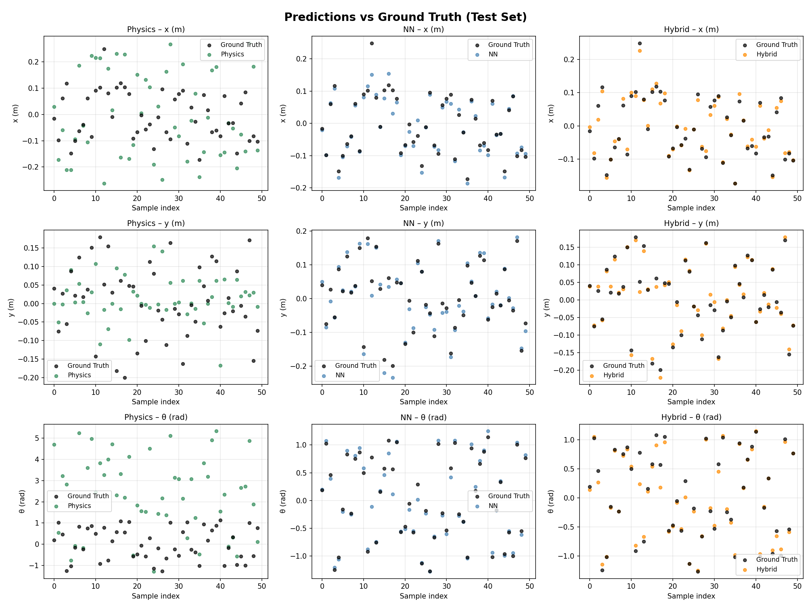
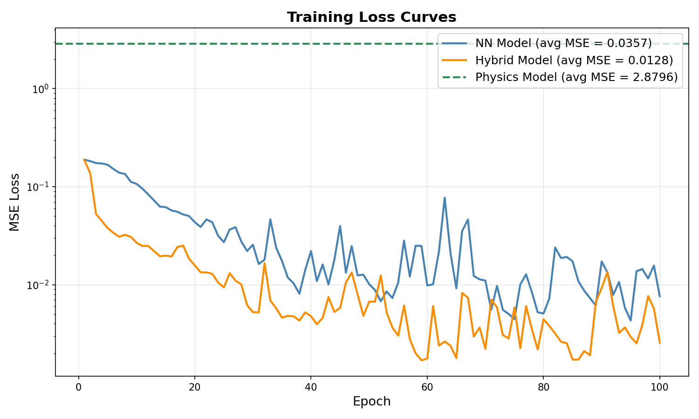

# Learning Push Dynamics

Physics-based, neural-network, and hybrid physics-informed models for learning planar robotic push dynamics, with forward prediction and gradient-based push planning in PyTorch.

## Overview

This project compares three modeling approaches for predicting the final pose of a rigid object after a planar push by a UR10 manipulator:

- **Physics model:** rigid-body dynamics with numerical integration and no training.
- **Neural network model:** fully connected MLP trained on push parameter and outcome pairs.
- **Hybrid model:** MLP augmented with the physics model prediction to combine prior structure with data-driven correction.

The task uses cracker-box pushing data where the input is a 3D push parameter vector and the output is the final object pose `[x, y, theta]`.

## Results

Held-out test-set performance:

| Model | Test MSE ↓ | MED (m) ↓ |
|---|---:|---:|
| Physics | 2.8598 | 2.4359 |
| Neural Network | 0.0075 | 0.0776 |
| Hybrid | **0.0036** | **0.0653** |

The hybrid model achieved the strongest forward-prediction performance, reducing test MSE from `0.0075` to `0.0036` relative to the pure neural model.

## Visual Results

### XY Trajectory Comparison



### Forward Prediction Comparison



### Training Curves



## Method

The project implements:

- Rigid-body push simulation with Euler integration.
- A sinusoidal push velocity profile.
- MLP-based forward dynamics learning.
- A hybrid physics-informed network using the physics prediction as an additional input.
- Gradient-based push planning through each frozen forward model.
- Evaluation using mean squared error and mean Euclidean distance.

## Repository Structure

```text
.
├── RBE577_Project2_Report.pdf
├── data/
│   └── genesis/
│       ├── data_x_cracker_box.npy
│       └── data_y_cracker_box.npy
└── src/
    ├── config/
    ├── helpers/
    ├── lib/
    │   ├── models.py
    │   └── physics.py
    ├── results/
    │   ├── predictions.png
    │   ├── training_curves.png
    │   └── xy_trajectories.png
    ├── main.py
    └── requirements.txt
```

## Setup

```bash
python3 -m venv .venv
source .venv/bin/activate
pip install --upgrade pip
pip install -r src/requirements.txt
```

## Run

```bash
cd src
python main.py
```

To resume from a checkpoint:

```bash
cd src
python main.py --checkpoint ./checkpoints/model_epoch_100.pth
```

## Report

The full technical report is available here:

[Open the PDF report](https://raw.githubusercontent.com/fmarcantoni/learning-push-dynamics/main/RBE577_Project2_Report.pdf)

## Notes

The virtual environment is intentionally excluded from version control. Recreate it locally using `src/requirements.txt`.
